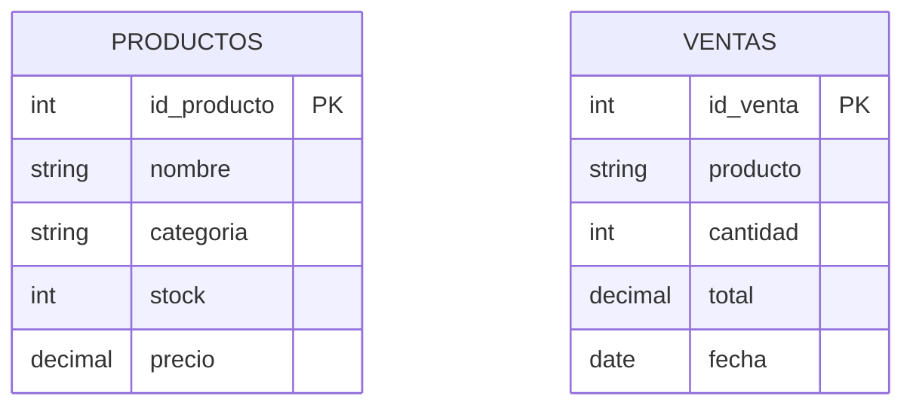
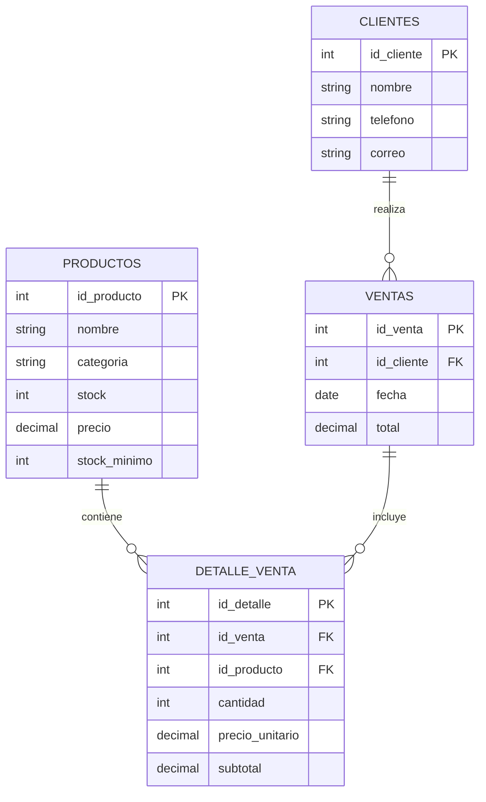
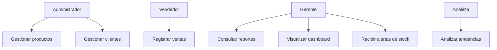
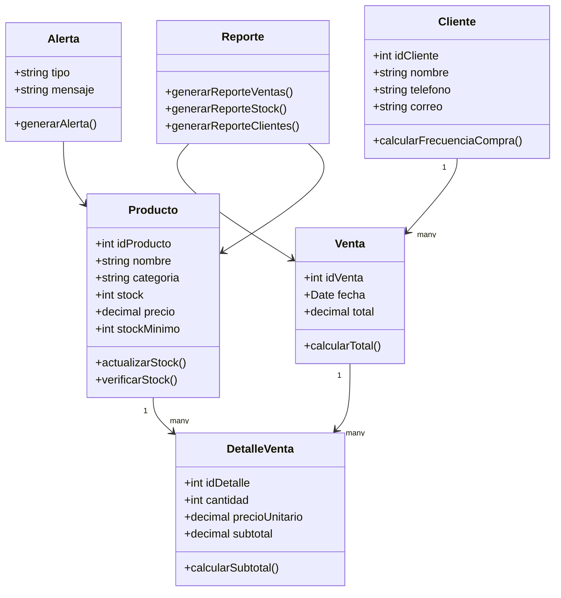
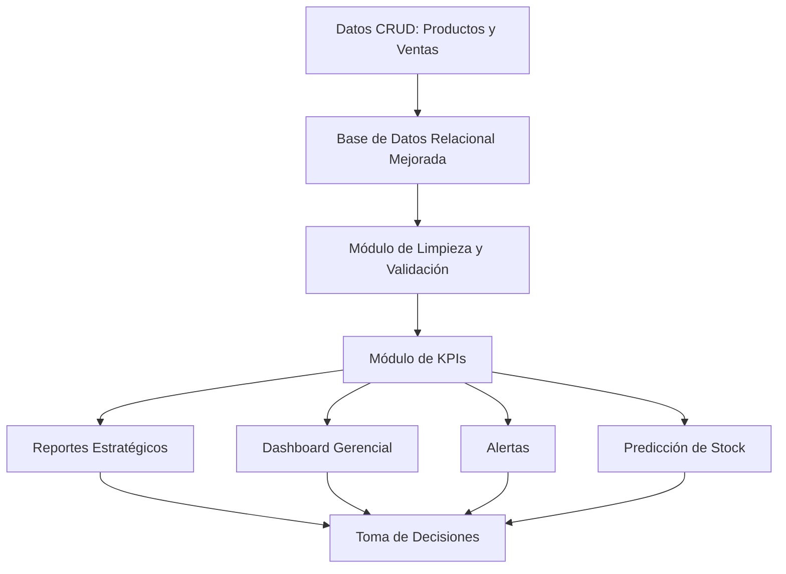

# Actividad 1: Auditoría de Sistemas Legacy

## “Del Dato a la Decisión” 🔍💻

# Estudiante

**Nombre:** Jose Tiago Sanchez Zabala
**Trabajo:** Individual
**Repositorio:** Público en GitHub

---

# 1. Datos Generales

**Empresa analizada:** Eco-Distribuidora S.A.
**Tipo de sistema:** Sistema CRUD Legacy de Inventario y Ventas
**Objetivo de la auditoría:** Diagnosticar las limitaciones de un sistema CRUD tradicional frente a las necesidades de un DSS, aplicando los principios de la Teoría General de Sistemas y considerando el impacto en la productividad laboral según el ODS 8.

---

# 2. Generación del Sistema Objetivo

Para esta actividad se generó un sistema legacy básico en Python con Flask, siguiendo la consigna de crear una aplicación CRUD simple para gestionar inventario y ventas.

El sistema fue construido intencionalmente como un software funcional, pero limitado para la toma de decisiones.

## Archivos del sistema

| Archivo            | Descripción                                   |
| ------------------ | --------------------------------------------- |
| `app.py`           | Aplicación CRUD básica desarrollada con Flask |
| `database.sql`     | Script SQL con las tablas Productos y Ventas  |
| `requirements.txt` | Dependencia necesaria para ejecutar Flask     |
| `README.md`        | Informe técnico de auditoría                  |

---

# 3. Instrucciones de Ejecución

## Requisitos

Tener instalado Python 3.

## Instalar dependencias

```bash
py -m pip install Flask
```

## Ejecutar el sistema

```bash
py app.py
```

## Abrir en el navegador

```text
http://127.0.0.1:5000
```

---

# 4. Descripción del Sistema Actual

El sistema generado es una aplicación CRUD básica para la gestión de inventario de la empresa ficticia Eco-Distribuidora S.A.

## Funcionalidades principales

* Registrar productos.
* Ver productos.
* Editar productos.
* Eliminar productos.
* Registrar ventas.
* Ver ventas.
* Mostrar información en tablas.

## Limitación principal

El sistema permite almacenar datos, pero no los transforma en información estratégica.

Por ejemplo, el sistema puede registrar productos y ventas, pero no puede responder preguntas importantes como:

* ¿Qué productos dejarán de tener stock en los próximos 15 días?
* ¿Qué productos generan más ingresos?
* ¿Qué clientes están disminuyendo su frecuencia de compra?
* ¿Qué productos tienen mayor rotación?
* ¿Cuándo se debe reponer inventario?

Esto demuestra que el sistema tiene datos, pero no genera conocimiento útil para la toma de decisiones.

---

# 5. Exploración del Sistema

Durante la exploración del sistema se verificó que la aplicación permite realizar operaciones CRUD básicas sobre productos y ventas.

Sin embargo, la interfaz se basa principalmente en tablas simples y extensas. Esto provoca que el usuario tenga que revisar manualmente los registros para encontrar información importante.

## Hallazgos principales

* No existen gráficos.
* No existen reportes gerenciales.
* No existen alertas de bajo stock.
* No existen cálculos de tendencia.
* No existe módulo de clientes.
* No existe análisis de frecuencia de compra.
* No existe predicción de agotamiento.
* No existe relación formal entre productos y ventas.

---

# 6. Diagrama de Base de Datos Actual

El sistema actual utiliza una base de datos simple con dos tablas principales: `productos` y `ventas`.



## Análisis del modelo actual

El modelo actual es limitado porque la tabla `ventas` guarda el producto como texto, en vez de utilizar una clave foránea hacia la tabla `productos`.

Esto genera problemas como:

* Duplicación de información.
* Errores de escritura.
* Ventas registradas con nombres diferentes para el mismo producto.
* Falta de trazabilidad entre inventario y ventas.
* Imposibilidad de obtener reportes confiables.

Ejemplo de inconsistencia:

* Arroz 1kg
* Arroz kilo
* Arroz 1 KG

El sistema puede interpretar esos valores como productos distintos, aunque representen el mismo producto.

---

# 7. Análisis desde la Teoría General de Sistemas

La Teoría General de Sistemas permite analizar un sistema como un conjunto de partes que interactúan entre sí.

En este caso, el sistema presenta fallas relacionadas con la entropía y la falta de sinergia.

---

# 7.1 Entropía del Sistema

La entropía representa el desorden, la pérdida de organización o el deterioro de la información dentro de un sistema.

## Falla 1: Información desordenada

El sistema almacena productos y ventas, pero solo los muestra en tablas. No organiza los datos en reportes útiles.

Esto genera saturación visual, pérdida de tiempo y dificultad para encontrar información relevante.

## Falla 2: Datos que se vuelven obsoletos

El sistema solo muestra el stock actual. No calcula cuánto tiempo durará ese stock según el ritmo de ventas.

Por ejemplo, si un producto tiene 30 unidades, el sistema no puede indicar si alcanzará para 3 días, 10 días o 1 mes.

## Falla 3: Falta de control de calidad de datos

El sistema permite registrar ventas con nombres de productos escritos de distintas formas. Esto reduce la confiabilidad de la información.

## Falla 4: Ausencia de retroalimentación

El sistema no genera alertas ni recomendaciones. Solo guarda datos, pero no retroalimenta al usuario con información útil para mejorar la gestión.

---

# 7.2 Falta de Sinergia

La sinergia ocurre cuando las partes del sistema trabajan juntas y generan un resultado superior.

En este sistema, las tablas de productos y ventas existen, pero no trabajan de manera integrada.

La suma de productos y ventas debería permitir generar información estratégica como:

* Productos más vendidos.
* Productos menos vendidos.
* Productos con bajo stock.
* Proyección de agotamiento.
* Ingresos por categoría.
* Tendencias de venta.

Sin embargo, el sistema solo muestra registros separados. Por eso, la suma de sus partes no genera valor superior.

---

# 8. Análisis Complementario con ISO 12207 e ISO 25010

Además del análisis desde TGS, se revisó el sistema con criterios de auditoría relacionados con ISO 12207 e ISO 25010.

## ISO 12207

La norma ISO 12207 se relaciona con los procesos del ciclo de vida del software, incluyendo análisis, diseño, desarrollo, mantenimiento, documentación y trazabilidad.

| Criterio          | Evaluación del sistema legacy                                                         |
| ----------------- | ------------------------------------------------------------------------------------- |
| Proceso de diseño | No se evidencia un diseño sólido previo. El sistema fue construido como CRUD básico.  |
| Trazabilidad      | No existe trazabilidad clara entre requerimientos de negocio y funciones del sistema. |
| Documentación     | La documentación es mínima y se enfoca en ejecución, no en decisiones técnicas.       |
| Mantenimiento     | El sistema mezcla lógica, interfaz y acceso a datos en una estructura simple.         |
| Evolución         | No está preparado para crecer hacia reportes, alertas, clientes o predicción.         |

## ISO 25010

La norma ISO 25010 evalúa la calidad del producto de software.

| Característica       | Estado     | Justificación                                     |
| -------------------- | ---------- | ------------------------------------------------- |
| Mantenibilidad       | Baja       | Código simple, poco modular y difícil de escalar. |
| Adecuación funcional | Media-baja | Registra datos, pero no ayuda a tomar decisiones. |
| Seguridad            | Baja       | No tiene login, roles ni control de permisos.     |
| Usabilidad           | Media-baja | Usa tablas extensas y no tiene dashboard.         |
| Confiabilidad        | Baja       | Permite inconsistencias y datos duplicados.       |

## Conclusión ISO

El sistema funciona como herramienta básica de registro, pero presenta debilidades en diseño, trazabilidad, mantenibilidad, seguridad, adecuación funcional y confiabilidad.

---

# 9. Mecanismos de Neguentropía Propuestos

La neguentropía permite reducir el desorden del sistema y mejorar su funcionamiento.

Se proponen los siguientes mecanismos:

## 1. Normalizar la base de datos

Separar correctamente productos, clientes, ventas y detalle de ventas.

## 2. Implementar claves foráneas

Relacionar productos con ventas para evitar datos aislados o duplicados.

## 3. Validar los datos ingresados

Evitar productos repetidos, ventas incompletas o nombres mal escritos.

## 4. Crear reportes automáticos

Generar reportes que ayuden a la gerencia a tomar decisiones.

## 5. Implementar alertas inteligentes

Mostrar alertas cuando un producto tenga bajo stock o riesgo de agotamiento.

## 6. Crear un dashboard gerencial

Mostrar información mediante gráficos, KPIs y tarjetas visuales.

---

# 10. Decisiones Críticas que el Sistema Actual No Puede Soportar

El sistema actual no permite soportar decisiones importantes del negocio.

## 1. Decidir qué productos deben reponerse

El sistema no predice qué productos se agotarán en los próximos días. Solo muestra el stock actual.

## 2. Decidir qué productos son más rentables

El sistema no calcula ingresos por producto ni identifica productos con mayor impacto económico.

## 3. Decidir qué clientes están disminuyendo su frecuencia de compra

El sistema no cuenta con una tabla de clientes ni registra frecuencia de compra.

## 4. Decidir qué productos deben dejar de comprarse

El sistema no identifica productos de baja rotación.

## 5. Decidir cuándo comprar nuevo inventario

El sistema no calcula fechas recomendadas de reposición.

---

# 11. Cuadro Comparativo: CRUD Actual vs DSS Necesario

| Aspecto               | CRUD Actual                             | DSS Necesario                           |
| --------------------- | --------------------------------------- | --------------------------------------- |
| Objetivo              | Registrar datos                         | Apoyar decisiones estratégicas          |
| Información           | Datos planos                            | Información analizada                   |
| Reportes              | No genera reportes estratégicos         | Genera reportes gerenciales             |
| Inventario            | Muestra stock actual                    | Predice quiebres de stock               |
| Ventas                | Lista ventas registradas                | Analiza tendencias de ventas            |
| Clientes              | No analiza clientes                     | Detecta clientes frecuentes o inactivos |
| Base de datos         | Tablas simples sin relaciones complejas | Modelo relacional integrado             |
| Interfaz              | Tablas largas y saturadas               | Dashboard visual con indicadores        |
| Toma de decisiones    | Manual e intuitiva                      | Basada en datos                         |
| Valor para la empresa | Bajo                                    | Alto                                    |

---

# 12. KPIs Propuestos para Transformar el CRUD en DSS

Para transformar el sistema actual en un DSS se proponen los siguientes indicadores clave.

## KPI 1: Rotación de Inventario

Permite conocer qué tan rápido se venden los productos.

```text
Rotación de Inventario = Cantidad Vendida / Stock Promedio
```

## KPI 2: Días Restantes de Stock

Permite estimar cuántos días faltan para que un producto se agote.

```text
Días Restantes de Stock = Stock Actual / Promedio de Ventas Diarias
```

## KPI 3: Productos Más Vendidos

Permite identificar los productos con mayor demanda.

```text
Productos Más Vendidos = SUMA de cantidades vendidas por producto
```

## KPI 4: Ingresos por Producto

Permite conocer qué productos generan mayores ingresos.

```text
Ingreso Total por Producto = Cantidad Vendida * Precio Unitario
```

## KPI 5: Clientes Inactivos

Permite identificar clientes que han dejado de comprar durante un periodo determinado.

```text
Cliente Inactivo = Cliente sin compras durante un periodo definido
```

## KPI 6: Productos con Bajo Stock

Permite identificar productos que se encuentran cerca de agotarse.

```text
Producto Crítico = Stock Actual <= Stock Mínimo
```

---

# 13. Reportes Estratégicos Propuestos

Para mejorar la toma de decisiones, el sistema DSS debería incluir al menos los siguientes reportes:

| Reporte                             | Utilidad                                       |
| ----------------------------------- | ---------------------------------------------- |
| Reporte de productos con bajo stock | Ayuda a evitar desabastecimiento               |
| Reporte de productos más vendidos   | Permite identificar productos de alta demanda  |
| Reporte de productos menos vendidos | Ayuda a detectar productos de baja rotación    |
| Reporte de ingresos por producto    | Permite conocer productos más rentables        |
| Reporte de tendencia de ventas      | Ayuda a analizar crecimiento o caída de ventas |
| Reporte de clientes inactivos       | Permite diseñar estrategias de fidelización    |

---

# 14. Propuesta de Evolución hacia un DSS

Para transformar el sistema CRUD actual en un DSS, se propone mejorar la arquitectura del sistema agregando nuevos módulos.

## Módulo de Reportes

Generará reportes de ventas, stock, productos más vendidos y productos menos vendidos.

## Módulo de Dashboard Gerencial

Mostrará KPIs, gráficos y alertas para apoyar la toma de decisiones.

## Módulo de Predicción de Stock

Calculará cuándo un producto podría agotarse según el promedio de ventas diarias.

## Módulo de Clientes

Permitirá registrar clientes y analizar su frecuencia de compra.

## Módulo de Alertas

Notificará situaciones críticas como bajo stock, caída de ventas o clientes inactivos.

## Módulo de Análisis Predictivo

Permitirá integrar datos actuales con proyecciones futuras para anticipar problemas de inventario y ventas.

---

# 15. Base de Datos Mejorada Propuesta



## Ventajas del modelo mejorado

* Evita duplicidad.
* Relaciona productos con ventas.
* Permite analizar clientes.
* Mejora la trazabilidad.
* Facilita reportes estratégicos.
* Permite construir un DSS real.

---

# 16. Diagramas UML Propuestos

## 16.1 Diagrama de Casos de Uso



## Descripción de casos de uso

| Caso de uso          | Descripción                                   |
| -------------------- | --------------------------------------------- |
| Gestionar productos  | Permite crear, modificar y eliminar productos |
| Registrar ventas     | Permite guardar ventas realizadas             |
| Gestionar clientes   | Permite administrar información de clientes   |
| Consultar reportes   | Permite revisar información estratégica       |
| Visualizar dashboard | Permite observar KPIs y gráficos              |
| Recibir alertas      | Notifica situaciones críticas                 |
| Analizar tendencias  | Permite estudiar el comportamiento de ventas  |

## 16.2 Diagrama de Clases



---

# 17. Arquitectura Lógica DSS Propuesta



Esta arquitectura permite pasar de un sistema que solamente registra datos a un sistema que genera información útil para decidir.

---

# 18. Impacto en la Productividad y ODS 8

El ODS 8 está relacionado con el trabajo decente y el crecimiento económico.

Un sistema ineficiente afecta directamente al trabajador porque lo obliga a revisar grandes tablas, calcular datos manualmente y tomar decisiones con información incompleta.

Esto puede provocar:

* Pérdida de tiempo.
* Mayor carga laboral.
* Estrés.
* Errores humanos.
* Baja productividad.
* Decisiones poco confiables.

Desde una perspectiva ética, el software debe ayudar al trabajador y no aumentar su carga. Un DSS permitiría automatizar análisis, reducir tareas repetitivas y mejorar la calidad del trabajo.

Por lo tanto, transformar el CRUD actual en un DSS no solo beneficia a la empresa, sino también a los trabajadores, porque mejora la productividad y promueve un entorno laboral más eficiente.

---

# 19. Conclusión

El sistema CRUD actual de Eco-Distribuidora S.A. cumple funciones básicas de registro, pero no es suficiente para apoyar decisiones estratégicas.

Desde la Teoría General de Sistemas se identificaron problemas de entropía, falta de sinergia y ausencia de retroalimentación. El sistema almacena datos, pero no los convierte en información útil.

Para evolucionar hacia un DSS se propone implementar una base de datos relacional mejorada, reportes inteligentes, KPIs, alertas automáticas, análisis de tendencias, gestión de clientes, predicción de stock y un dashboard gerencial.

De esta manera, la empresa puede pasar del simple registro de datos a la toma de decisiones estratégicas basadas en información confiable.

---

# 20. Evidencia de Participación

| Participante              | Aporte realizado                                                                                        | Firma |
| ------------------------- | ------------------------------------------------------------------------------------------------------- | ----- |
| Jose Tiago Sanchez Zabala | Desarrollo del CRUD legacy, análisis TGS, propuesta DSS, KPIs, documentación Markdown y reflexión ODS 8 | JTSZ  |

---

# 21. Checklist de Evaluación

| Criterio                                                             | Cumple |
| -------------------------------------------------------------------- | ------ |
| El informe identifica al menos 2 fallas relacionadas con la Entropía | Sí     |
| El informe explica la falta de Sinergia del sistema                  | Sí     |
| Se proponen al menos 3 KPIs para transformar el sistema en DSS       | Sí     |
| El informe está redactado en Markdown directamente en GitHub         | Sí     |
| Se evidencia la participación mediante firma en el documento         | Sí     |
| El análisis incluye reflexión sobre productividad y ODS 8            | Sí     |
| Incluye diagrama de base de datos actual                             | Sí     |
| Incluye cuadro comparativo CRUD Actual vs DSS Necesario              | Sí     |
| Incluye propuesta de evolución hacia DSS                             | Sí     |
| Incluye diagramas UML propuestos                                     | Sí     |
| Incluye mecanismos de neguentropía                                   | Sí     |
| Incluye sistema objetivo CRUD generado                               | Sí     |

---

# 22. Enlace del Repositorio

**URL del repositorio público:**
Pegar aquí el enlace del repositorio de GitHub.
