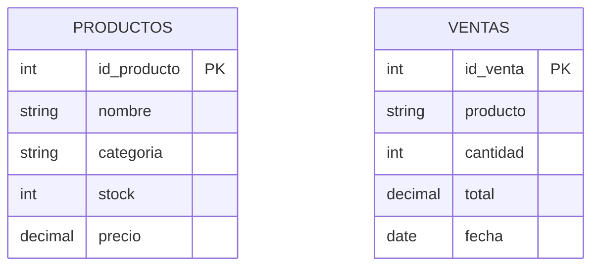
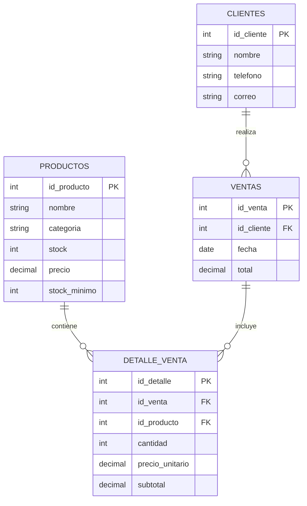
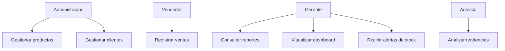
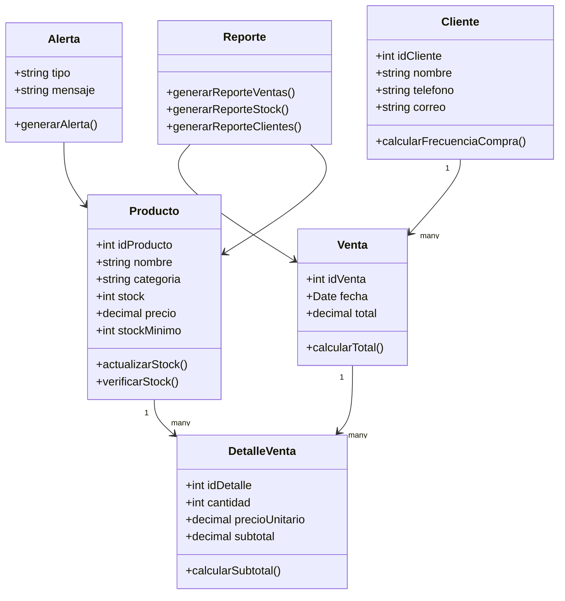

# actividad-1-auditoria-sistema-legacy
# Estudiante: Jose Tiago Sanchez Zabala


## 1. Datos Generales

**Empresa analizada:** Eco-Distribuidora S.A.
**Tipo de sistema:** Sistema CRUD Legacy de Inventario y Ventas
**Objetivo de la auditoría:** Diagnosticar las limitaciones de un sistema CRUD tradicional frente a las necesidades de un DSS, aplicando principios de la Teoría General de Sistemas y considerando el impacto en la productividad laboral según el ODS 8.

### Integrantes del Squad

| Integrante   | Rol en la actividad                       |
| ------------ | ----------------------------------------- |
| Integrante 1 | Análisis del sistema CRUD                 |
| Integrante 2 | Análisis de Entropía y Sinergia           |
| Integrante 3 | Propuesta de KPIs y DSS                   |
| Integrante 4 | Documentación en GitHub y reflexión ODS 8 |

---

# 2. Introducción

La empresa ficticia **Eco-Distribuidora S.A.** cuenta con un sistema informático tradicional que permite registrar productos y ventas. Sin embargo, aunque el sistema almacena datos, no ayuda a la gerencia a tomar decisiones estratégicas.

El sistema actual funciona como un CRUD básico, es decir, permite crear, leer, actualizar y eliminar registros. No obstante, presenta limitaciones importantes porque no genera reportes inteligentes, no analiza tendencias, no predice quiebres de stock y no permite identificar clientes o productos críticos.

Por esta razón, se realiza una auditoría técnica para analizar por qué el sistema actual es insuficiente para la toma de decisiones y cómo podría evolucionar hacia un **DSS, Sistema de Soporte a la Decisión**.

---

# 3. Descripción del Sistema Objetivo

El sistema objetivo generado corresponde a una aplicación CRUD básica para la gestión de inventario de una tienda.

## Funcionalidades principales del sistema actual

* Registrar productos.
* Ver lista de productos.
* Editar productos.
* Eliminar productos.
* Registrar ventas.
* Ver lista de ventas.
* Mostrar información en tablas.

## Problema principal

El sistema permite almacenar información, pero no la transforma en conocimiento útil para la empresa.

Por ejemplo, el sistema puede mostrar que existen productos y ventas, pero no puede responder preguntas como:

* ¿Qué productos se agotarán en los próximos 15 días?
* ¿Qué productos generan más ingresos?
* ¿Qué clientes están comprando menos?
* ¿Qué productos tienen mayor rotación?
* ¿Cuándo se debe reponer inventario?

Esto demuestra que el sistema tiene datos, pero no tiene capacidad de análisis.

---

# 4. Diagrama de la Base de Datos Actual

El sistema actual trabaja con una base de datos simple formada principalmente por dos tablas: `Productos` y `Ventas`.



## Análisis del modelo actual

El modelo de datos es limitado porque la tabla `Ventas` guarda el producto como texto en lugar de relacionarlo mediante una clave foránea con la tabla `Productos`.

Esto provoca problemas como:

* Duplicación de información.
* Errores al escribir nombres de productos.
* Dificultad para relacionar ventas con productos reales.
* Falta de trazabilidad.
* Imposibilidad de generar reportes confiables.

Ejemplo de problema:

Un mismo producto podría registrarse de diferentes maneras:

* Arroz 1kg
* Arroz 1 KG
* Arroz kilo

El sistema podría interpretar esos datos como productos distintos, aunque representen el mismo producto.

---

# 5. Análisis desde la Teoría General de Sistemas

La Teoría General de Sistemas permite analizar el sistema como un conjunto de partes relacionadas entre sí. En este caso, el sistema presenta fallas importantes de **Entropía** y **Sinergia**.

---

# 5.1 Entropía del Sistema

La entropía representa el desorden, la pérdida de control o el deterioro de la información dentro de un sistema.

En el sistema auditado se identificaron las siguientes fallas de entropía:

## Falla 1: Información desordenada

El sistema muestra grandes cantidades de datos en tablas, pero no los organiza en reportes útiles. Esto genera saturación visual y dificulta que el usuario encuentre información importante.

El trabajador debe revisar manualmente los registros para intentar encontrar patrones, lo cual aumenta el tiempo de trabajo y la posibilidad de cometer errores.

## Falla 2: Datos que se vuelven obsoletos

El sistema solo muestra el stock actual, pero no calcula cuánto durará ese stock según el ritmo de ventas.

Por ejemplo, si un producto tiene 30 unidades disponibles, el sistema no puede decir si esas unidades alcanzarán para 3 días, 10 días o 1 mes.

Esto hace que la información pierda valor rápidamente.

## Falla 3: Falta de validación y control

Al no existir relaciones fuertes entre las tablas, se pueden registrar ventas de productos mal escritos o incluso productos que no existen en la tabla principal.

Esto genera desorden en los datos y reduce la confiabilidad de la información.

---

# 5.2 Falta de Sinergia

La sinergia ocurre cuando las partes de un sistema trabajan juntas y producen un resultado superior.

En el sistema actual, las partes existen, pero no trabajan de forma integrada.

La tabla de productos y la tabla de ventas deberían combinarse para generar información estratégica, como:

* Productos más vendidos.
* Productos menos vendidos.
* Stock crítico.
* Tendencias de ventas.
* Ingresos por categoría.
* Proyección de inventario.

Sin embargo, el sistema solo muestra registros separados. Por esta razón, la suma de las partes no genera un valor superior.

En otras palabras, el sistema tiene piezas, pero no tiene cerebro estratégico.

---

# 6. Decisiones Críticas que el Sistema Actual No Puede Soportar

El sistema actual no permite tomar decisiones importantes para la empresa. Entre las principales decisiones que no puede soportar se encuentran:

## 1. Decidir qué productos deben reponerse

El sistema no predice qué productos se agotarán pronto. Solo muestra el stock actual.

## 2. Decidir qué productos son más rentables

El sistema no calcula ingresos por producto ni identifica cuáles generan mayor beneficio económico.

## 3. Decidir qué clientes están disminuyendo su frecuencia de compra

El sistema no cuenta con un módulo de clientes ni analiza el comportamiento de compra.

## 4. Decidir qué productos deberían dejar de comprarse

El sistema no identifica productos con baja rotación o ventas débiles.

## 5. Decidir cuándo comprar nuevo inventario

El sistema no calcula fechas recomendadas de reposición.

---

# 7. Cuadro Comparativo: CRUD Actual vs DSS Necesario

| Aspecto               | CRUD Actual                     | DSS Necesario                           |
| --------------------- | ------------------------------- | --------------------------------------- |
| Objetivo              | Registrar datos                 | Apoyar la toma de decisiones            |
| Información           | Datos planos                    | Información analizada                   |
| Reportes              | No genera reportes estratégicos | Genera reportes gerenciales             |
| Inventario            | Muestra stock actual            | Predice quiebres de stock               |
| Ventas                | Lista ventas registradas        | Analiza tendencias de ventas            |
| Clientes              | No analiza clientes             | Detecta clientes frecuentes o inactivos |
| Base de datos         | Tablas simples                  | Modelo relacional integrado             |
| Interfaz              | Tablas largas y saturadas       | Dashboard visual con indicadores        |
| Valor para la empresa | Bajo                            | Alto                                    |
| Toma de decisiones    | Manual e intuitiva              | Basada en datos                         |

---

# 8. KPIs Propuestos para Transformar el CRUD en DSS

Para convertir el sistema en un DSS, se proponen los siguientes indicadores clave de rendimiento:

---

## KPI 1: Rotación de Inventario

Permite conocer qué tan rápido se venden los productos.

```text
Rotación de Inventario = Cantidad Vendida / Stock Promedio
```

Este KPI ayuda a identificar productos de alta y baja demanda.

---

## KPI 2: Días Restantes de Stock

Permite estimar cuántos días faltan para que un producto se agote.

```text
Días Restantes de Stock = Stock Actual / Promedio de Ventas Diarias
```

Este indicador es importante para evitar quiebres de stock.

---

## KPI 3: Productos Más Vendidos

Permite identificar los productos con mayor demanda.

```text
Productos Más Vendidos = SUMA de cantidades vendidas por producto
```

Este KPI ayuda a priorizar productos importantes para la empresa.

---

## KPI 4: Ingresos por Producto

Permite conocer qué productos generan más dinero.

```text
Ingreso Total por Producto = Cantidad Vendida * Precio Unitario
```

Este KPI permite tomar mejores decisiones comerciales.

---

## KPI 5: Clientes Inactivos

Permite identificar clientes que han disminuido su frecuencia de compra.

```text
Cliente Inactivo = Cliente sin compras durante un periodo determinado
```

Este indicador ayuda a crear estrategias de fidelización.

---

# 9. Propuesta de Evolución hacia un DSS

Para transformar el sistema CRUD actual en un Sistema de Soporte a la Decisión, se propone implementar nuevos módulos y mejorar la arquitectura del sistema.

---

# 9.1 Nuevos Módulos Propuestos

## Módulo de Reportes

Permitirá generar reportes sobre:

* Ventas diarias.
* Ventas semanales.
* Ventas mensuales.
* Productos más vendidos.
* Productos menos vendidos.
* Productos con bajo stock.

## Módulo de Dashboard Gerencial

Permitirá visualizar indicadores importantes mediante gráficos y tarjetas informativas.

Ejemplos:

* Total vendido en el mes.
* Productos con stock crítico.
* Ventas por categoría.
* Top 5 productos más vendidos.

## Módulo de Predicción de Stock

Permitirá calcular cuándo un producto podría agotarse según el promedio de ventas.

## Módulo de Clientes

Permitirá registrar clientes y analizar su comportamiento de compra.

## Módulo de Alertas

Permitirá generar alertas automáticas cuando:

* Un producto tenga bajo stock.
* Un producto esté cerca de agotarse.
* Las ventas disminuyan.
* Un cliente deje de comprar.

---

# 10. Base de Datos Mejorada Propuesta

Para mejorar el sistema, se propone una base de datos relacional más completa.



## Ventajas del nuevo modelo

* Evita duplicidad de datos.
* Relaciona productos con ventas.
* Permite analizar clientes.
* Facilita reportes.
* Mejora la trazabilidad.
* Permite construir indicadores para DSS.

---

# 11. Diagramas UML Propuestos

---

# 11.1 Diagrama de Casos de Uso



## Descripción de casos de uso principales

| Caso de uso          | Descripción                                       |
| -------------------- | ------------------------------------------------- |
| Gestionar productos  | Permite registrar, modificar y eliminar productos |
| Registrar ventas     | Permite guardar ventas realizadas                 |
| Gestionar clientes   | Permite administrar información de clientes       |
| Consultar reportes   | Permite revisar información estratégica           |
| Visualizar dashboard | Permite ver indicadores importantes               |
| Recibir alertas      | Notifica situaciones críticas                     |
| Analizar tendencias  | Permite estudiar el comportamiento de ventas      |

---

# 11.2 Diagrama de Clases



---

# 12. Mecanismos de Neguentropía

La neguentropía permite reducir el desorden del sistema y mejorar su funcionamiento.

Para este caso se proponen los siguientes mecanismos:

## 1. Normalización de la base de datos

Separar correctamente las entidades productos, clientes, ventas y detalle de ventas.

## 2. Uso de claves foráneas

Relacionar las tablas para evitar datos aislados o inconsistentes.

## 3. Validación de datos

Evitar productos duplicados, ventas incorrectas o registros incompletos.

## 4. Automatización de reportes

Reducir el trabajo manual mediante reportes automáticos.

## 5. Implementación de alertas inteligentes

Avisar al usuario cuando exista riesgo de desabastecimiento.

## 6. Dashboard visual

Presentar información clara mediante gráficos e indicadores.

---

# 13. Impacto en la Productividad y ODS 8

El ODS 8 está relacionado con el trabajo decente y el crecimiento económico.

Un sistema ineficiente afecta directamente a los trabajadores porque los obliga a realizar tareas repetitivas, revisar grandes tablas manualmente y tomar decisiones con información incompleta.

Esto puede generar:

* Pérdida de tiempo.
* Mayor carga laboral.
* Estrés.
* Errores humanos.
* Baja productividad.
* Decisiones poco confiables.

Desde una perspectiva ética, el software debe ayudar al trabajador y no complicar sus tareas. Un sistema DSS permitiría automatizar análisis, mejorar la productividad y facilitar la toma de decisiones.

Por lo tanto, transformar el CRUD actual en un DSS no solo beneficia a la empresa, sino también a los trabajadores, porque reduce tareas manuales y mejora la calidad del trabajo.

---

# 14. Conclusión

El sistema CRUD actual de Eco-Distribuidora S.A. cumple con funciones básicas de registro, pero no es suficiente para apoyar decisiones estratégicas.

Desde la Teoría General de Sistemas, se identificaron problemas de entropía, falta de sinergia y ausencia de mecanismos de retroalimentación. El sistema almacena datos, pero no los convierte en información útil.

Para evolucionar hacia un DSS, se recomienda implementar una base de datos relacional más completa, reportes inteligentes, KPIs, alertas automáticas, análisis de tendencias, gestión de clientes y un dashboard gerencial.

De esta manera, la empresa podrá pasar de simplemente guardar datos a tomar decisiones estratégicas basadas en información confiable.

---

# 15. Checklist de Evaluación

| Criterio                                                             | Cumple |
| -------------------------------------------------------------------- | ------ |
| El informe identifica al menos 2 fallas relacionadas con la Entropía | Sí     |
| El informe explica la falta de Sinergia del sistema                  | Sí     |
| Se proponen al menos 3 KPIs para transformar el sistema en DSS       | Sí     |
| El informe incluye cuadro comparativo CRUD vs DSS                    | Sí     |
| El informe incluye diagrama de base de datos actual                  | Sí     |
| El informe incluye propuesta de base de datos mejorada               | Sí     |
| El informe incluye diagramas UML                                     | Sí     |
| El informe está redactado en Markdown                                | Sí     |
| Se incluye reflexión sobre productividad y ODS 8                     | Sí     |
| Se evidencia participación de los 4 integrantes                      | Sí     |

---

# 16. Evidencia de Participación

| Integrante   | Aporte realizado                                   |
| ------------ | -------------------------------------------------- |
| Integrante 1 | Exploración y análisis del sistema legacy          |
| Integrante 2 | Identificación de fallas de Entropía y Sinergia    |
| Integrante 3 | Propuesta de KPIs y evolución hacia DSS            |
| Integrante 4 | Redacción del informe, diagramas y reflexión ODS 8 |

---

# 17. Enlace del Repositorio

**URL del repositorio:**
Pegar aquí el enlace del repositorio público de GitHub.


